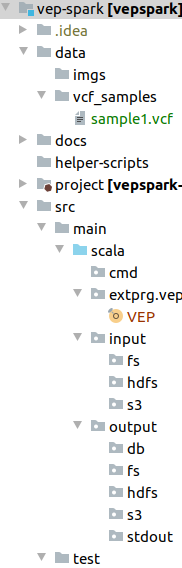

# vep-spark project

## I. Project structure 

### 1. data directory
It contains data samples for testing and other resources such as images, files for document writing
### 2. docs
This folder contains all documents such as installation guide, dev-guide, how-to-run guide ... of vepspark project
### 3. helper-scripts
It contains all necessary to setup development environment, production environment automatically
### 4. project
It contains build scenario for vepspark project
### 5. src
This folder contains main source code
#### 5.1. src.main.scala
vepspark is developed by two programming languages: Scala and Python. This folder contains scala source code (scala package)
scala package contains some sub-package
##### a. cmd
Command line packages handle input arguments and call to core modules
##### b. extprg
External program, In this project we focus on VEP, but it can be other programs
##### c. input
Handle input files. Input files can come from local file system (fs), hadoop file system (hdfs), cloud object file system (s3).
##### d. output
Output of external program (VEP) can push to stdout or file (on fs, hdfs, s3) or push to database (elasticsearch, postgres, mongodb ...)
All modules which handle output of external program will be placed here
### 6. test
Contain unittests and integration tests

