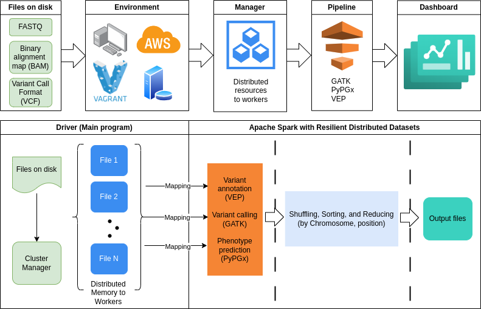

# Spark4VCF

**Spark4VCF** is a scalable and high performance toolkit for the analysis, annotation, and prioritization of genomic variants.

---

## Table of Contents

1. [Introduction](#1-introduction)
2. [Features](#2-features)
3. [Installation](#3-installation)
4. [Usage](#4-usage)
   - [VEP](#41-vep---variant-effect-predictor)
   - [PyPGx](#42-pypgx---pharmacogenomics-analysis)
   - [GATK](#43-gatk---genome-analysis-toolkit)

---

## 1. Introduction

Spark4VCF was created by the software development team at **Vinbigdata's Biomedical Information Center**. It leverages Apache Spark parallelism to speed up data processing times of genomic tools like VEP, GATK, PyPGx, etc.

With a simple architecture, the integration of bioinformatics tools with Spark is easy and effective. Each tool is wrapped as a Spark job — the driver partitions the input VCF into chunks, distributes annotation tasks across workers, and collects the results back into a single output file.

The architecture of Spark4VCF is shown in the following figure:



---

## 2. Features

| Feature | Description |
|---|---|
| 🧬 **VEP integration** | Parallel annotation using Ensembl VEP |
| 💊 **PyPGx integration** | Distributed pharmacogenomics analysis per sample batch |
| 🔬 **GATK integration** | Parallelized interval-based variant calling with HaplotypeCaller |
| 🖥️ **Unified CLI** | Single `spark4vcf` entry point for all supported tools |
| 🚧 **ANNOVAR** *(in development)* | Spark-based wrapper for ANNOVAR annotation |
| 🚧 **DeepVariant** *(in development)* | Distributed deep learning variant calling with DeepVariant |
| 🚧 **SnpEff** *(in development)* | Parallel functional variant annotation with SnpEff |

---

## 3. Installation

### Prerequisites

- Java 8
- Apache Spark 2.4+
- [SBT](https://www.scala-sbt.org/) (build tool, auto-installed by `install.sh`)
- [Pixi](https://pixi.sh) for managing tool environments (VEP, PyPGx, etc.)

### Build from Source

```bash
git clone https://github.com/vinhdc10998/Spark4VCF.git
cd Spark4VCF
./install.sh
```

`install.sh` will:
1. Install SBT if not already present
2. Build the fat JAR via `sbt assembly`
3. Copy the `spark4vcf` wrapper script and `vaspark-0.1.jar` to `~/.local/bin/`

Make sure `~/.local/bin` is in your `PATH`:

```bash
export PATH="$HOME/.local/bin:$PATH"
```

### Install Tool Environments (Pixi)

Spark4VCF uses [Pixi](https://pixi.sh) to manage reproducible environments for each bioinformatics tool:

```bash
# Install default environment (VEP 115 + bcftools + PyPGx)
pixi install

# Install VEP 108 environment
pixi install -e vep108
```

### Deploy on a Local Cluster (VirtualBox)

Since we don't have multiple physical machines to build a full cluster, we simulate a multi-node Spark cluster by running Virtual Machines (VMs) using [VirtualBox](https://www.virtualbox.org/) and [Vagrant](https://www.vagrantup.com/). This approach lets us develop, test, and benchmark Spark4VCF on a realistic distributed setup from a single PC.

- 📄 [VirtualBox Deployment Guide](./docs/virtualbox_deployment.md)

### Deploy on AWS

- 📄 [AWS Deployment Guide](./docs/aws_deployment.md)

---

## 4. Usage

The `spark4vcf` CLI is a friendly wrapper around `spark-submit`. It auto-locates the built JAR and routes arguments to the correct tool.

```
spark4vcf [spark-submit-args] <tool> [tool-args...]
```

**Valid tools:** `vep`, `pypgx`, `gatk`, `annovar`, `snpeff`, `deepvariant`

---

### 4.1 VEP — Variant Effect Predictor

Annotates variants in a VCF file using [Ensembl VEP](https://www.ensembl.org/vep), distributed across Spark partitions (default: 2500 variants/partition).

**Syntax:**
```bash
spark4vcf [spark-args] vep \
  --offline --cache --no_stats \
  --force_overwrite \
  --dir_cache /path/to/vep_cache \
  --vcf --af --appris --biotype \
  --buffer_size 500 --check_existing --distance 5000 \
  --mane --polyphen b --pubmed --regulatory \
  --sift b --species homo_sapiens \
  --symbol --transcript_version --tsl \
  -i /data/input.vcf.gz \
  -o /data/output.vep.vcf.gz
```

**Example (local mode):**
```bash
spark4vcf --master local[*] vep \
  --offline --cache --no_stats --force_overwrite \
  --dir_cache /spark4vcf/tools/ensembl-vep/ \
  --vcf --af --appris --biotype \
  --buffer_size 500 --check_existing --distance 5000 \
  --mane --polyphen b --pubmed --regulatory \
  --sift b --species homo_sapiens \
  --symbol --transcript_version --tsl \
  -i /data/1KGP.chr22.900000.vcf.gz \
  -o /data/output/1KGP.chr22.vep.vcf.gz
```

**How it works:**
1. The input VCF is uploaded to HDFS (if local).
2. The header is extracted and variant lines are partitioned into chunks of 2500 (can modify and rebuild).
3. Each Spark task runs VEP on its chunk, writing output to STDOUT.
4. Results are merged back into a single output file (local or HDFS).

---

### 4.2 PyPGx — Pharmacogenomics Analysis

Runs [PyPGx](https://pypgx.readthedocs.io) pharmacogenomics pipelines in parallel, distributing sample batches across Spark workers.

**Syntax:**
```bash
spark4vcf [spark-args] pypgx <pipeline> <GENE> <OUTPUT_DIR> <VCF_FILE> [pypgx-options]
```

**Supported pipelines:** `run-ngs-pipeline`, `run-chip-pipeline`

**Example (chip pipeline, local mode):**
```bash
spark4vcf --master local[*] pypgx \
  run-chip-pipeline CYP2D6 \
  /data/output/pypgx/CYP2D6/ \
  /data/1KGP.chr22.norm.1000.vcf.gz \
  --assembly GRCh38 --force
```

**Example (NGS pipeline):**
```bash
spark4vcf --master local[*] pypgx \
  run-ngs-pipeline CYP2D6 \
  /data/output/pypgx/CYP2D6-ngs/ \
  /data/variants.vcf.gz \
  --assembly GRCh38
```

**How it works:**
1. Sample names are extracted from the VCF using `bcftools`.
2. Samples are grouped into batches of 10 (can modify and rebuild) and written to temporary sample list files.
3. Each Spark task runs `pypgx` on its sample batch, writing to a unique subdirectory under `OUTPUT_DIR`.

---

### 4.3 GATK — Genome Analysis Toolkit

Runs [GATK HaplotypeCaller](https://gatk.broadinstitute.org) in parallel across genomic intervals.

**Syntax:**
```bash
spark4vcf [spark-args] gatk <gatk-subcommand> [gatk-options]
```

**Example:**
```bash
spark4vcf --master local[*] gatk \
  HaplotypeCaller \
  --java-options -Xmx4g \
  -R /data/Homo_sapiens_assembly38.fasta \
  -I /data/sample.bam \
  -O /data/output/ \
  -ERC GVCF
```

**How it works:**
1. The input interval list is split into chunks (default: 3 intervals/task).
2. Each Spark task runs GATK on its subset of intervals.
3. Per-interval VCF outputs are written to the specified output directory.

---

## Project Structure

```
Spark4VCF/
├── src/main/scala/
│   └── extprg/
│       ├── vep/          # VEP Spark wrapper
│       ├── pypgx/        # PyPGx Spark wrapper
│       ├── gatk/         # GATK Spark wrapper
│       ├── snpeff/       # SnpEff Spark wrapper
│       ├── annovar/      # ANNOVAR Spark wrapper
│       └── deepvariant/  # DeepVariant Spark wrapper
├── docs/                 # Deployment guides (VirtualBox, AWS)
├── scripts/              # Cluster bootstrap scripts
├── ansible/              # Ansible playbooks for cluster setup
├── kubernetes/           # Kubernetes deployment manifests
├── pixi.toml             # Pixi environment definitions
├── build.sbt             # SBT build configuration
├── spark4vcf             # CLI wrapper script
└── install.sh            # Build and install script
```

---

## Tech Stack

| Component | Version |
|---|---|
| Apache Spark | 2.4.0 |
| Scala | 2.11.12 |
| Ensembl VEP | 108 / 115 |
| PyPGx | ≥ 0.26.0 |
| GATK | 4.1.9.0 |
| bcftools / samtools | 1.21 |
| Java | 8 |

---

## License

This project is licensed under the [MIT License](./LICENSE).

Developed and maintained by the **Biomedical Information Center, Vinbigdata**.
